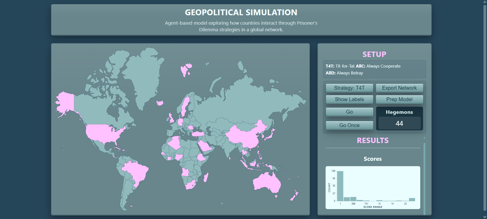

# 🌍 Geopolitical Simulation - Agent-Based Model in React



A React/TypeScript implementation of an agent-based geopolitical simulation using Prisoner's Dilemma game theory, originally modeled in NetLogo.

## 💡 Motivation

This project recreates a NetLogo model I worked with years ago during my studies, reimagined as a modern web application. The goal was to explore whether complex agent-based modeling could be effectively translated from NetLogo to React while maintaining interactivity and visualization quality.

## 🎯 verview

270 countries interact through the Prisoner's Dilemma framework, where cooperation and betrayal dynamics shape global power structures. Countries employ different strategies (Tit-for-Tat, Always Cooperate, Always Betray) and compete with neighbors based on GDP-weighted scores.

**Key Concepts:**

- **Hegemons**: Countries stronger than all their neighbors (pink)
- **Rivalry**: Strategic defection against strongest/weakest neighbors
- **Tit-for-Tat**: Reciprocal strategy - mirror neighbor's last action

## ✨ Features

- **Interactive World Map**: 270 countries with real-time strategy visualization
- **Three Strategy Types**: Compare T4T, Always Cooperate, Always Betray
- **Live Graphs**: 
  - Hegemon count timeline
  - Average payoffs (hegemons vs others)
  - Score distribution histogram
- **Touch-Optimized**: Mobile-friendly tooltip interactions
- **Network Export**: CSV export of country relationships

## 🛠️ Tech Stack

- **React 19** + **TypeScript** + **Vite**
- **SVG-based visualization** for map and graphs
- **Papaparse** for CSV handling
- **i18n-iso-countries** for country code conversion

## 🚀 Running Locally

```bash
npm install
npm run dev
```

## 📊 Model Comparison: NetLogo vs React

| Aspect | NetLogo | This Implementation |
| -------- | --------- | --------------------- |
| Visualization | Patches & Turtles | SVG paths & interactive graphs |
| State Management | Built-in tick system | React useState + useCallback |
| Interactivity | Limited UI controls | Full web interface with touch support |
| Data Export | CSV only | CSV + visual graph exports (planned) |
| Performance | ~100 ticks/sec | ~10 ticks/sec (optimizable) |

## 🙏 Credits & Sources

**Original Model:**  
[GeopoliticalPD_Model2 by Andrew Crooks](https://github.com/acrooks2/ClassModels/tree/master/CSS600Models/GeopoliticalPD_Model2)  
NetLogo agent-based simulation of geopolitical dynamics using Prisoner's Dilemma

**World Map SVG:**  
[Blank World Map by panfilov](https://codepen.io/panfilov/pen/xwodvW)  
High-quality SVG map with 270 country paths

## 📄 License

MIT

---

**Note**: This is an educational project demonstrating the translation of agent-based models from NetLogo to modern web technologies.
